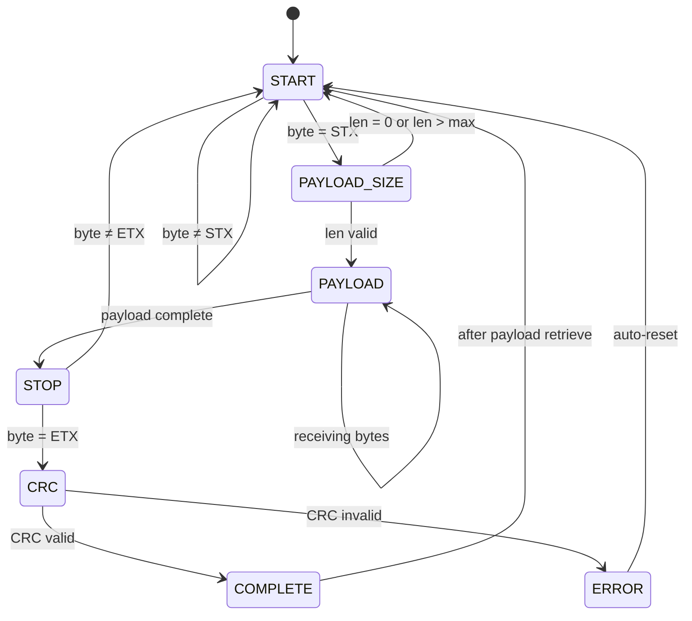

# Framing Library

A simple C library for framing data packets with support for simple frame formats, including start and stop delimiters, payload extraction, and CRC checks.

## Frame Format

```text
[START_DELIMITER] [PAYLOAD SIZE] [PAYLOAD...] [STOP_DELIMITER] [CRC8]
```

Example: `0xAA 0x04 0x01 0x02 0x03 0x04 0x55 0x33`

| Field | Value | Description |
| ------- | ------- | ------------- |
| START | 0xAA | Start delimiter |
| PAYLOAD SIZE | 0x04 | Payload size (4 bytes) |
| PAYLOAD | 0x01 0x02 0x03 0x04 | Data bytes |
| STOP | 0x55 | Stop delimiter |
| CRC8 | 0x33 | CRC-8 checksum |

## Frame-Processing State Machine

This state machine is expected to be run each time a new byte is available in the RX buffer. Upon receiving a complete frame, the payload can be retrieved using the provided API functions.



## Usage Example

```c
#include "framing.h"

void main(void)
{
    /* 1. Allocate buffers */
    uint8_t rx_raw_buffer[64]   = {0}; // Enough size for incoming raw data
    uint8_t tx_frame_buffer[16] = {0}; // Enough size for outgoing frames (>= max frame size)
    uint8_t parsing_buffer[16]  = {0}; // Internal buffer for parsing bytes (>= max frame size)

    /* 2. Initialize ring buffer for RX (filled by ISR) */
    struct ring_buffer rx_buffer = {
        .buffer    = rx_raw_buffer,
        .size      = sizeof(rx_raw_buffer),
        .overwrite = true
    };
    ring_buffer_init(&rx_buffer);

    /* 3. Initialize linear buffer for TX frames */
    struct buffer tx_buffer = {
        .buffer = tx_frame_buffer,
        .size   = sizeof(tx_frame_buffer),
        .index  = 0
    };
    buffer_init(&tx_buffer);

    /* 4. Initialize internal parsing buffer */
    struct buffer int_buffer = {
        .buffer = parsing_buffer,
        .size   = sizeof(parsing_buffer),
        .index  = 0
    };
    buffer_init(&int_buffer);

    /* 5. Configure CRC-8 calculator */
    struct crc crc8 = {
        .crc8_polynomial      = 0x97,
        .crc8_initial_value   = 0x00,
        .crc8_final_xor_value = 0x00,
        .reflect_input        = false,
        .reflect_output       = false
    };

    /* 6. Initialize framing instance with dependency injection */
    struct framing framing_instance = {
        .crc8_calculator  = &crc8,
        .rx_raw_buffer    = &rx_buffer,
        .tx_frame_buffer  = &tx_buffer,
        .parsing_buffer   = &int_buffer,
        .start_delimiter  = 0xAA,
        .stop_delimiter   = 0x55,
        .max_payload_size = 0x04
    };
    framing_init(&framing_instance);
}
```

## Processing Received Data

```c
/* ISR pushes bytes into ring buffer */
void uart_rx_isr(void) {
    uint8_t byte = URXBF;
    ring_buffer_push(&rx_buffer, &byte, 1);
}

/* Main loop processes frames */
while (1) {
    if(framing_process_incoming_data(&framing_instance) == 0)
    {
        uint8_t payload[4];
        uint8_t payload_size;
        if (framing_retrieve_payload(&framing_instance, payload, &payload_size) == 0) {
            /* Handle received payload */
        }
    }
    /* Other application tasks */
}
```

## Building Frames to be Transmitted

```c
uint8_t payload[] = {0x01, 0x02, 0x03, 0x04};
uint8_t frame_size;

framing_build_frame(&framing_instance, payload, sizeof(payload), &frame_size);

/* Frame is now in tx_frame_buffer, ready to transmit */
uint8_t* frame = framing_instance.tx_frame_buffer->buffer;
uart_transmit(frame, frame_size);
```
